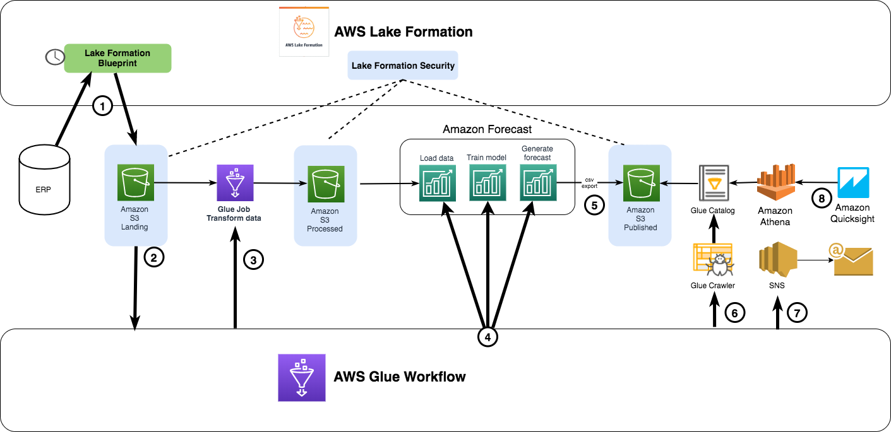

# Amazon Forecast Automation
AWS Glue jobs orchestrated via AWS Glue Workflow to automate the data import, training the predictor and generating forecast export from the Amazon Forecast service.

This is the supporting code for the blog <b> "Building end to end automated inventory forecasting capability with AWS Lake Formation and Amazon Forecast" </b>.

## Components
1. AWS Glue PySpark job to transform raw data into required format for Amazon Forecast
2. AWS Glue Python shell jobs to load data, train predictor, generate forecast and export forecast to s3 bucket
3. AWS Glue Workflow DAG to orchestrate the above functions
